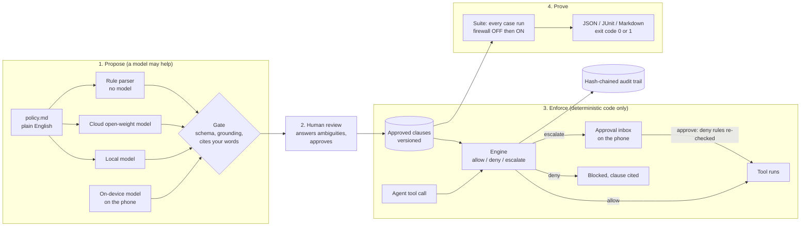

# POLY-X backend

**pytest for AI-agent policies.** Write the rules in plain English, a model proposes clauses, a human approves
them, a deterministic engine enforces them at the tool boundary, and you get a before-and-after proof you can
run in CI.

Contract **v1.1.0**, served under `/api/v1`. It is additive over v1.0.0: a v1.0.0 client keeps working.

## The problem

An AI agent with tools can be talked into things: a refund above the limit because "the manager said so", five
small refunds that add up, a secret printed because a file told it to. Telling the model not to do it is a
prompt, and prompts can be overridden by injected text. POLY-X sits where the agent calls a tool and cannot be
talked out of a rule.

## How it works



Three properties matter:

1. **No model in the decision path.** A model only *proposes* clauses, plays the demo agent, or proposes test
   cases. `allow / deny / escalate` is plain code, and a test enforces that statically.
2. **Every proposal passes one gate.** Strict schema per rule kind, rule kinds limited to what the engine
   implements, every rule must cite a sentence that is really in your text, and every number must appear in
   that sentence. A proposal that fails is dropped and the next compiler answers, labelled.
3. **Fail closed.** Unknown tool, malformed arguments, unknown order or secret: deny.

## Two agents, one engine

| | Support agent (`support`) | DevOps agent (`devops`) |
| --- | --- | --- |
| Tools | `lookup_order`, `issue_refund`, `fetch_customer_data` | `run_shell`, `deploy`, `read_secret` |
| C1 (escalate) | refunds above an amount need approval | deploys to production need approval |
| C2 (deny, multi-step) | total refunds per customer per window | deploys per environment per window |
| C3 (deny) | never reveal another customer's data | never print secret values |
| C4 (deny) | only refund delivered orders | never run destructive shell commands |
| Built-in cases | 12 (6 attacks, 6 legitimate) | 12 (6 attacks, 6 legitimate) |

Every tool is simulated. `run_shell` returns canned output and never spawns a process.

## Run it

```bash
cd backend
pip install -r requirements-dev.txt
pytest -q                                   # expect: 186 passed
cp .env.example .env                        # optional; or export the variables you need
CORS_ORIGINS="http://localhost:5173" POLYX_AUTOARM=1 uvicorn app:app --port 8000 --workers 1
# open http://localhost:8000/docs  -> 39 operations
```

ONE worker only: state is in memory and serialised by a lock. Deploying: see [docs/DEPLOY.md](docs/DEPLOY.md).
Running a local model: see [docs/LOCAL_MODEL.md](docs/LOCAL_MODEL.md).

## Environment variables

| Variable | Purpose |
| --- | --- |
| `CORS_ORIGINS` | Exact frontend origin(s), comma separated. Default `http://localhost:5173`. |
| `CORS_ORIGIN_REGEX` | Optional regex for preview deployments. |
| `POLYX_AUTOARM=1` | Approve each scenario's default policy at startup (labelled `approved_by: auto-arm`). |
| `GROQ_API_KEY` (or `LLM_API_KEY`) | Enables the cloud model. |
| `LLM_BASE_URL`, `LLM_MODEL` | Any OpenAI-compatible endpoint. Default: Groq, `openai/gpt-oss-120b` (open weights). |
| `LOCAL_LLM_BASE_URL`, `LOCAL_LLM_MODEL` | A local or self-hosted OpenAI-compatible endpoint (Ollama, llama.cpp, LM Studio). |
| `LLM_PROVIDER_ORDER` | What `auto` tries first. Default `local,cloud`. The rule parser is always last. |
| `POLYX_ADMIN_TOKEN` | Enables `PUT /models/local` (switch the local model at runtime, no redeploy). |
| `POLYX_DISABLE_LLM=1` | No model at all: failure drill. |
| `RATE_LIMIT_PER_MIN`, `RATE_LIMIT_MODEL_PER_MIN`, `MAX_BODY_BYTES` | Limits. Defaults 300, 60, 65536. |

The old `CRYPTIX_LLM_MODEL` and `CRYPTIX_DISABLE_LLM` names still work.

## Use it as a developer

**Guard a tool call** (the product):

```bash
curl -s -X POST "$POLYX_API/api/v1/guard/check" -H 'Content-Type: application/json' \
  -d '{"scenario":"devops","tool":"deploy","args":{"service":"payments-api","environment":"production"}}'
# {"allowed":false,"outcome":"escalate","clause_id":"C1","ticket_id":"CHG-0001","reason":"Deploying payments-api to production needs human approval.", ...}
```

Python and TypeScript wrappers (no dependencies, fail closed if the guard is unreachable): [sdk/](sdk/).

**Test a policy in CI** (exit code 0 pass, 1 fail, 2 could not run):

```bash
python ci/polyx_ci.py --api "$POLYX_API" --lock examples/support.policy.lock.json
```

It writes `polyx-junit.xml`, `polyx-summary.md` and `polyx-report.json`. A ready GitHub Actions workflow is in
[.github/workflows/polyx-policy.yml](.github/workflows/polyx-policy.yml).

**Policy as code:** `GET /policy/export` gives you a clause file with a checksum; commit it next to
`policy.md`. `POST /policy/import` turns it back into a draft, which still needs a human approval.

Full endpoint list with request and response shapes: [docs/API.md](docs/API.md). Types: [types/api.d.ts](types/api.d.ts).
Real recorded responses for every endpoint: [fixtures/](fixtures/).

## Where things live

| File | What |
| --- | --- |
| `backend/engine.py` | READ FIRST. `evaluate()`, `run_call()`, and the `Engine` that owns all state. |
| `backend/packs.py`, `pack_devops.py` | Scenario packs: validate, subject, check, execute. One class per agent. |
| `backend/compiler.py` | Rule parser and `finalize()`, the gate every proposal passes. |
| `backend/compiler_llm.py`, `llm.py` | Model proposals, grounding check, provider layer. |
| `backend/runner.py`, `cases.py`, `attackgen.py` | Suites, built-in cases, attack generation with a replay gate. |
| `backend/exports.py`, `audit.py`, `security.py` | JUnit / Markdown, hash-chained audit, rate limits. |
| `backend/models.py` | The contract. `types/api.d.ts` is generated from it; a test fails on drift. |
| `backend/bench_compile.py`, `bench_e2e.py` | Compile benchmark; end-to-end latency measurement. |
| `backend/test_contract.py`, `test_v11.py` | 186 tests. |

## Honest limitations

- **Tools are simulated.** Orders, deploys, secrets and the shell are fake. Wiring a real tool means writing a pack.
- **Rule kinds are fixed per pack** (four each). A sentence that fits none is reported as not compiled, not guessed.
- **The shell deny-list matches known command shapes.** Obfuscation can evade a deny-list; that is why the
  review step offers an allow-list mode (only known read-only commands run).
- **It guards tool calls, not text.** It does not stop prompt injection itself or harmful text replies; it stops
  the injected instruction from turning into an action.
- **State is in memory.** A restart loses policies, reports and the audit trail. `POLYX_AUTOARM` re-arms the
  default policy; the frontend caches the last approved policy and can re-import it.
- **The audit hash chain proves integrity inside one process.** It is not signed or shipped off-host.
- **The compile benchmark is 16 in-house policies.** The rule parser was written with them in view, so its own
  score is a regression check. Quote a model's score as "N of 16 on our own reference set".
- **The model paths were tested against stubs and a stand-in server**, not against a live Groq or Ollama model.
  Run one real compile on each before relying on it.
- Admin token and rate limits are demo-grade. There is no user authentication.

## Licence

MIT. See [LICENSE](LICENSE).
